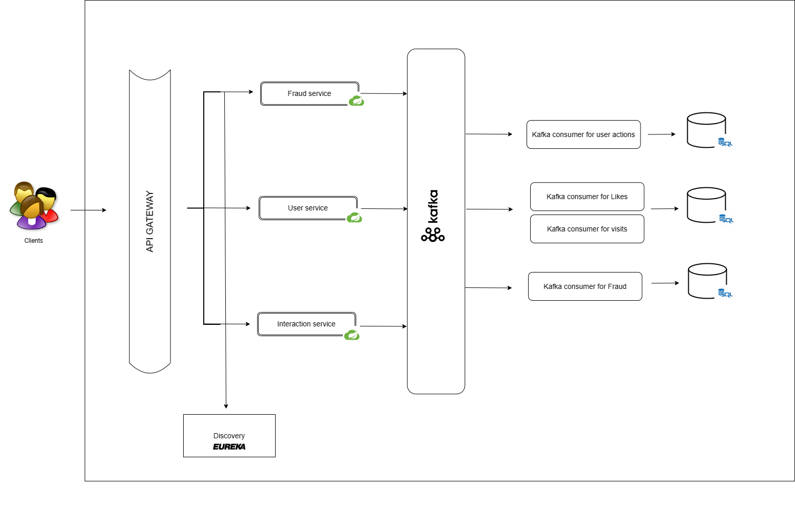

## Design and Implementation of a Microservices Architecture 
### Prerequisites
This project is build using:
Spring Boot: 3.2.3
Java: 17
kafka: kafka_2.13

- **This project is build using:** 
  - Spring Boot: 3.2.3
  - Java: 17
  - kafka: kafka_2.13

- **User service Endpoints** 
  - User CRUD operations: /user
  - /user/interact
  - /user/profile/{user_id}/visitors
- **Interaction service Endpoints**
  - /interaction
- **Fraud service Endpoints**
  - /fraud

- **Architecture** 

